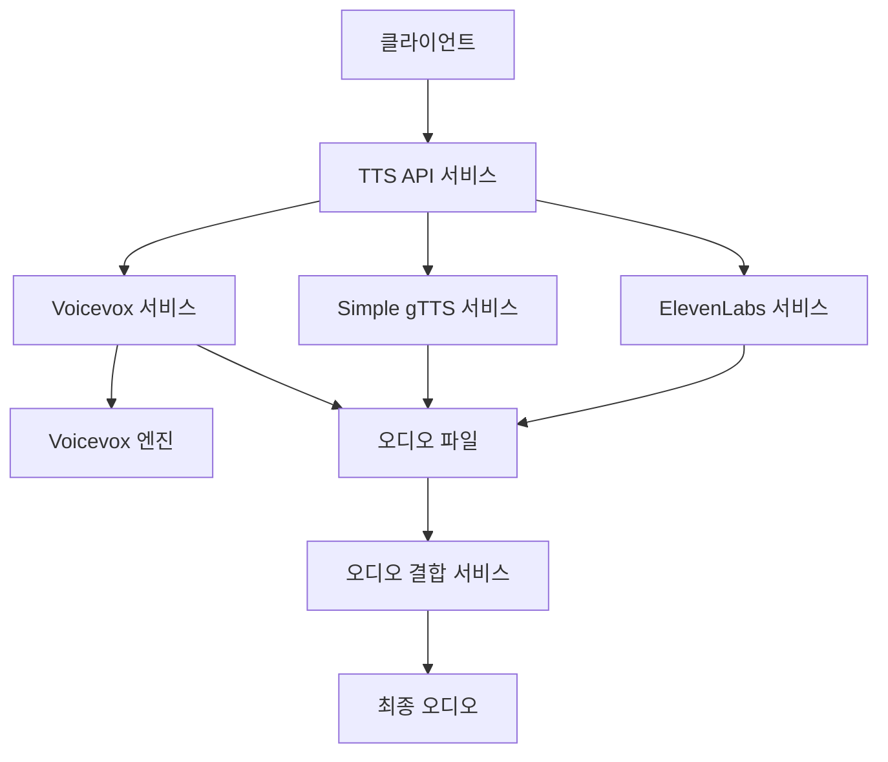
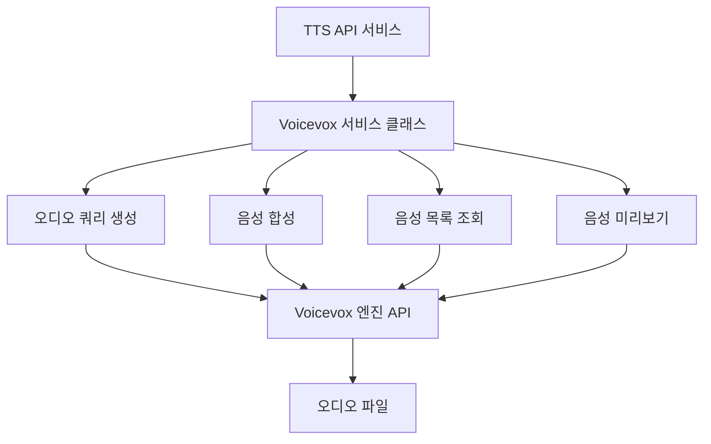
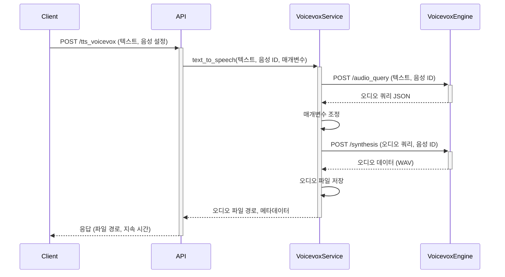

# 디자인 문서

## 개요

이 디자인 문서는 기존 TTS API 서비스에 Voicevox 텍스트 음성 변환 엔진을 통합하는 방법을 설명합니다. Voicevox는 일본어에 특화된 오픈 소스 텍스트 음성 변환 엔진으로, 다양한 캐릭터 음성을 제공합니다. 이 통합을 통해 사용자는 기존 ElevenLabs TTS 기능과 함께 Voicevox 음성을 사용하여 일본어 및 가능한 경우 한국어 음성을 생성할 수 있습니다.

## 아키텍처

### 전체 시스템 아키텍처



### Voicevox 통합 아키텍처



## 구성 요소 및 인터페이스

### 1. Voicevox 서비스 클래스

`VoicevoxService` 클래스는 Voicevox 엔진과의 모든 상호 작용을 처리합니다. 이 클래스는 다음과 같은 주요 기능을 제공합니다:

- 텍스트를 오디오로 변환
- 사용 가능한 음성 목록 검색
- 음성 미리보기 생성
- 오류 처리 및 로깅

```python
class VoicevoxService:
    def __init__(self, base_url: str = "http://localhost:50021"):
        """Voicevox 서비스 초기화"""
        self.base_url = base_url
        self.logger = logging.getLogger(__name__)
    
    async def text_to_speech(self, text: str, speaker_id: int = 1, **params) -> bytes:
        """텍스트를 오디오로 변환"""
        # 1. 오디오 쿼리 생성
        # 2. 오디오 합성
        # 3. 오디오 데이터 반환
        pass
    
    async def get_speakers(self) -> List[Dict]:
        """사용 가능한 음성 목록 검색"""
        pass
    
    async def get_speaker_preview(self, speaker_id: int) -> bytes:
        """음성 미리보기 생성"""
        pass
```

### 2. API 엔드포인트

새로운 API 엔드포인트는 기존 TTS API 서비스에 추가됩니다:

#### `/tts_voicevox` (POST)

텍스트를 Voicevox 음성으로 변환합니다.

**요청 형식:**
```json
{
  "segments": [
    {
      "id": 1,
      "text": "こんにちは、世界！"
    }
  ],
  "tempdir": "voicevox_test",
  "speaker_id": 1,
  "speed_scale": 1.0,
  "pitch_scale": 0.0,
  "intonation_scale": 1.0,
  "volume_scale": 1.0,
  "pre_phoneme_length": 0.1,
  "post_phoneme_length": 0.1
}
```

**응답 형식:**
```json
[
  {
    "sequence": 1,
    "text": "こんにちは、世界！",
    "durationMillis": 1500,
    "path": "outputs/voicevox_test/001.wav"
  }
]
```

#### `/voices/voicevox` (GET)

사용 가능한 Voicevox 음성 목록을 반환합니다.

**응답 형식:**
```json
[
  {
    "speaker_id": 1,
    "name": "四国めたん",
    "style_id": 2,
    "style_name": "ノーマル",
    "type": "talk"
  },
  ...
]
```

#### `/voices/voicevox/{speaker_id}/sample` (GET)

특정 Voicevox 음성의 미리보기를 생성합니다.

**응답:** 오디오 파일 (WAV 형식)

### 3. 데이터 모델

Voicevox 통합을 위한 새로운 데이터 모델:

```python
class VoicevoxTTSRequest(BaseModel):
    segments: List[Segment]
    tempdir: str
    speaker_id: int = 1  # 기본값: 四国めたん (노멀)
    speed_scale: float = Field(default=1.0, ge=0.5, le=2.0)  # speedScale
    pitch_scale: float = Field(default=0.0, ge=-0.15, le=0.15)  # pitchScale
    intonation_scale: float = Field(default=1.0, ge=0.0, le=2.0)  # intonationScale
    volume_scale: float = Field(default=1.0, ge=0.0, le=2.0)  # volumeScale
    pre_phoneme_length: float = Field(default=0.1, ge=0.0, le=1.5)  # prePhonemeLength
    post_phoneme_length: float = Field(default=0.1, ge=0.0, le=1.5)  # postPhonemeLength
    enable_interrogative_upspeak: bool = Field(default=True)  # 의문문 자동 조정

class VoicevoxSpeaker(BaseModel):
    speaker_id: int
    name: str
    style_id: int
    style_name: str
    type: str
```

## 데이터 흐름

### 텍스트 음성 변환 프로세스

1. 클라이언트가 `/tts_voicevox` 엔드포인트에 텍스트와 음성 설정을 포함한 요청을 보냅니다.
2. API 서비스는 요청을 검증하고 `VoicevoxService`에 전달합니다.
3. `VoicevoxService`는 다음 단계를 수행합니다:
   a. Voicevox 엔진의 `/audio_query` 엔드포인트를 호출하여 오디오 쿼리를 생성합니다.
   b. 사용자 설정에 따라 오디오 쿼리 매개변수를 조정합니다.
   c. Voicevox 엔진의 `/synthesis` 엔드포인트를 호출하여 오디오를 생성합니다.
   d. 생성된 오디오를 지정된 출력 디렉토리에 저장합니다.
4. API 서비스는 생성된 오디오 파일의 경로와 메타데이터를 포함한 응답을 반환합니다.



## 오류 처리

### 오류 유형 및 처리 방법

1. **연결 오류**: Voicevox 엔진에 연결할 수 없는 경우
   - 적절한 HTTP 503 오류 반환
   - 로그에 연결 실패 기록
   - 재시도 메커니즘 구현 (선택 사항)

2. **잘못된 요청 오류**: 잘못된 매개변수 또는 지원되지 않는 텍스트
   - HTTP 400 오류 반환
   - 구체적인 오류 메시지 제공

3. **음성 ID 오류**: 존재하지 않는 음성 ID
   - HTTP 404 오류 반환
   - 사용 가능한 음성 ID 목록 제안

4. **엔진 오류**: Voicevox 엔진 내부 오류
   - HTTP 500 오류 반환
   - 로그에 상세한 오류 정보 기록
   - 민감한 정보는 사용자에게 노출하지 않음

## 테스트 전략

### 단위 테스트

1. `VoicevoxService` 클래스의 각 메서드에 대한 단위 테스트
2. 모의 Voicevox 엔진 응답을 사용한 테스트
3. 오류 처리 및 예외 테스트

### 통합 테스트

1. 실제 Voicevox 엔진과의 통합 테스트
2. 다양한 텍스트 및 매개변수 조합 테스트
3. 한국어 텍스트 지원 테스트 (가능한 경우)

### 엔드 투 엔드 테스트

1. 전체 API 워크플로우 테스트
2. `/combine_wav` 엔드포인트와의 호환성 테스트
3. 성능 및 부하 테스트

## Docker 통합

Voicevox 엔진은 Docker를 통해 쉽게 배포할 수 있습니다. 다음은 Docker 통합 방법입니다:

### Docker Compose 구성

```yaml
version: '3'
services:
  tts-api:
    build: .
    ports:
      - "8000:8000"
    depends_on:
      - voicevox-engine
    environment:
      - VOICEVOX_URL=http://voicevox-engine:50021

  voicevox-engine:
    image: voicevox/voicevox_engine:cpu-latest
    ports:
      - "50021:50021"
```

### 환경 변수 구성

- `VOICEVOX_URL`: Voicevox 엔진 URL (기본값: "http://localhost:50021")
- `VOICEVOX_TIMEOUT`: Voicevox 엔진 요청 타임아웃 (초) (기본값: 30)

## 한국어 지원 검토

Voicevox는 기본적으로 일본어에 특화되어 있지만, 한국어 텍스트를 처리하는 방법을 검토했습니다:

1. **직접 지원**: Voicevox는 현재 한국어를 직접 지원하지 않습니다.
2. **음역 변환**: 한국어 텍스트를 일본어 발음으로 변환하는 방법을 시도할 수 있습니다.
   - 한국어 텍스트 → 로마자 변환 → 일본어 가타카나 변환 → Voicevox 처리
   - 이 방법은 완벽한 한국어 발음을 제공하지 않지만, 제한된 한국어 지원을 위한 대안이 될 수 있습니다.
3. **향후 개선**: 한국어 지원을 위한 별도의 모델이나 엔진을 통합하는 방안을 고려할 수 있습니다.

## 상업적 사용 가능한 무료 음성 목록

Voicevox는 상업적 사용이 가능한 여러 무료 음성을 제공합니다. 다음은 상업적 사용 가능한 주요 음성 목록입니다:

### 완전 무료 상업적 사용 가능 (크레딧 표기 필요)

1. **ずんだもん (Zundamon)** ⭐⭐⭐⭐⭐ 추천
   - speaker_id: 3 (노멀)
   - speaker_id: 1 (あまあま) 
   - speaker_id: 5 (ツンツン)
   - speaker_id: 22 (セクシー)
   - 크레딧: "VOICEVOX:ずんだもん"

2. **四国めたん (Shikoku Metan)** ⭐⭐⭐⭐⭐ 추천
   - speaker_id: 2 (노멀)
   - speaker_id: 0 (あまあま)
   - speaker_id: 6 (ツンツン)
   - speaker_id: 4 (セクシー)
   - 크레딧: "VOICEVOX:四国めたん"

3. **春日部つむぎ (Kasukabe Tsumugi)** ⭐⭐⭐⭐
   - speaker_id: 8 (노멀)
   - 크레딧: "VOICEVOX:春日部つむぎ"

4. **雨晴はう (Amehare Hau)** ⭐⭐⭐
   - speaker_id: 10 (노멀)
   - 크레딧: "VOICEVOX:雨晴はう"

5. **波音リツ (Namine Ritsu)** ⭐⭐⭐
   - speaker_id: 9 (노멀)
   - 크레딧: "VOICEVOX:波音リツ"

### 별도 엔진 (완전 무료 상업적 사용)

6. **VOICEVOX Nemo** ⭐⭐⭐⭐
   - 별도 .vvpp 엔진 설치 필요
   - 크레딧: "VOICEVOX Nemo"
   - 고품질 음성 제공

이러한 음성들은 모두 상업적 용도로 사용할 수 있으며, 적절한 크레딧 표기만 하면 됩니다. 각 음성의 자세한 사용 조건은 Voicevox 공식 사이트의 이용약관을 참조하시기 바랍니다.

## 결론

이 디자인 문서는 Voicevox 텍스트 음성 변환 엔진을 기존 TTS API 서비스에 통합하는 방법을 설명합니다. 이 통합을 통해 사용자는 무료로 사용할 수 있는 다양한 일본어 음성을 활용할 수 있으며, 기존 ElevenLabs 및 gTTS 기능과 함께 사용할 수 있습니다. Docker를 통한 쉬운 배포와 확장 가능한 아키텍처를 통해 시스템을 효율적으로 관리할 수 있습니다.